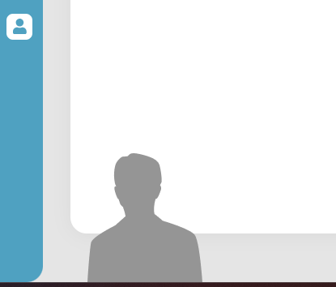
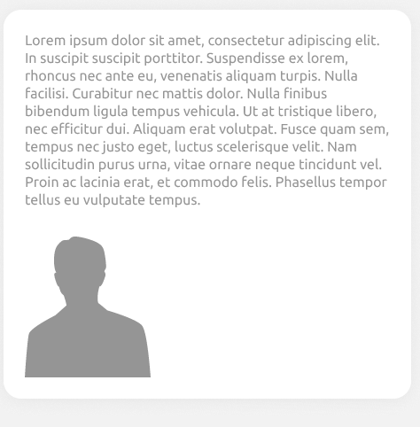
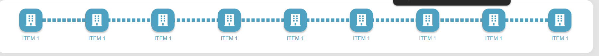
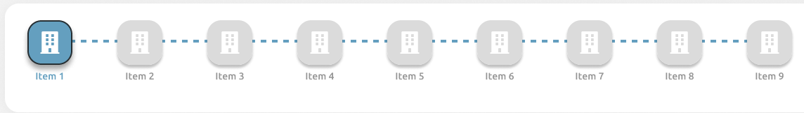
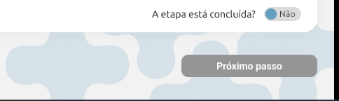
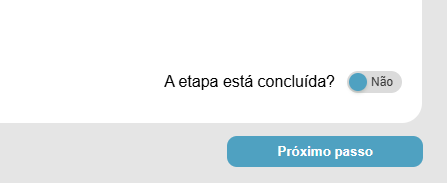
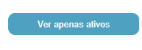
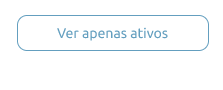
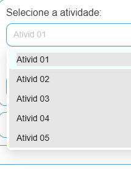

## 🎨 Testes no UI (desing) do site

Nesta documentação, irei relatar todas as observações e falhas que encontrei na análise dos componentes gráficos do site de testes em comparação com o protótipo. Foram analisados elementos como imagens desalinhadas, fontes incorretas e botões com padrões de cores diferentes dos do protótipo.

Para a análise desses elementos, foi feito uso de teste manual do site.

## 🏠 Testes página inicial

Logo de início, na página inicial, é possível notar discordâncias em relação ao protótipo. Como, por exemplo, a marca d'água que representa uma pessoa. É possível notar que essa imagem está fora da div principal, fugindo das margens.

## Testes:

    

## Prototipo:

    

## Menu Superior

Outra observação de falha possível de reparar logo de cara quando entramos no site é em relação ao menu superior que faz referência ao passo a passo de cadastro de um novo funcionário.

Aqui no site de testes, esse menu está com a enumeração errada; todos estão como 'Item 1', enquanto no protótipo estão numerados de 1 a 9. Também é possível notar que todos os itens estão na cor azul, como se todos os passos já houvessem sido concluídos, mesmo que não tenham sido. No de Testes, também é possível notar que  as letras de todos os itens estão em caixa alta.

Uma outra falha é que, no site protótipo, a caixa desses ícones possui contornos na cor preta, enquanto no de testes não.

## Testes:

    

## Prototipo:

    

## 🔻 Opções no inferior

Outra falha encontrada é em relação a uma decoração de fundo na parte inferior direita. No site protótipo, existe essa decoração:

    

Enquanto no de testes não possui essa decoração:

 
    

Nas imagens que mostrei acima, também é possível notar que as cores no botão de 'Próximo passo' estão desconfiguradas. No protótipo, o botão fica em cinza enquanto não marcamos a opção 'A etapa está concluída?'. Somente após marcar como concluída é que o botão fica em azul.

Já no de testes, o botão permanece em azul o tempo todo, mesmo que ainda não tenhamos marcado como etapa concluída.

Há uma grande diferença em como as cores dos botões estão configuradas nos dois sites. Enquanto no de testes o botão 'Ver apenas ativos', quando selecionado, fica com o fundo completamente em azul, no protótipo, quando selecionado, esse mesmo botão fica com o fundo em branco e o contorno das letras e do botão em azul.

## Testes:

    

## Prototipo:

    

Outro erro possível de notar é no texto da página inicial. O texto é quase semelhante entre os dois sites, a única diferença é em uma palavra. Enquanto no de Testes uma palavra presente no texto é 'rhoncus', no protótipo essa mesma palavra, na verdade, é 'thoncus'.

## 📝 Tela de cadastro de novo funcionário

UUma falha de texto bastante perceptível presente no site é na parte de 'Atividades' do funcionário. No protótipo, vemos escrito, como: 'Atividades 1', 'Atividades 2' e etc. Porém, no de testes, esses mesmos textos estão incompletos, como pode ser visto na imagem abaixo:

    

## ✅ Conclusões dos testes manuais feitos:

Após realizados os testes, ficou claro que o site possui vários erros de front-end no que diz respeito à harmonia dos elementos gráficos, sendo facilmente corrigidos com alteração do código. Acredito que todos esses erros não façam com que o site se torne inutilizável. Um usuário conseguirá se orientar nele, porém não terá uma experiência muito satisfatória.

Uma sugestão minha é que fosse desenvolvido um modo de alternância entre o modo claro e escuro para o site, pois assim o usuário poderia se adaptar melhor de acordo com sua preferência.