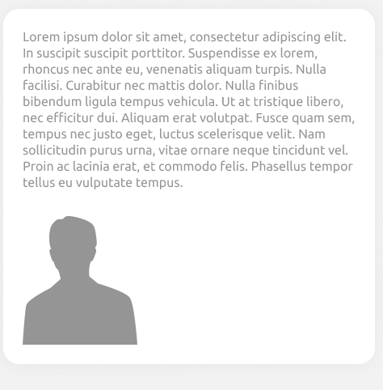

## Testes no UI (desing) do site

Nessa documentação irei relatar todas as observações e falhas que encontrei na observação do site de testes. Bem como imagens desalinhadas, fontes incorretas e botões com padrões de cores diferentes do protótipo.

## Testes página inicial

Logo de inicio na página inicial é possivel notar descordancias em relação ao protótipo. Como por exemplo, a marca da água que representa uma pessoa, é possivel notar que essa imagem está fora da div principal, fugindo das margens.

Testes:

    

Prototipo:

    

Outra observação de falha possivel reparar logo de cara quando entramos no site é em relação ao menu superior que faz referência ao passo a passo de cadastro de um novo funcionário.

Aqui no site de testes esse menu está com a enumeração errada, todos estão como "Item 1", enquanto que no prototipo estão númerados de 1 a 9. Também é possivel notar que todos os itens estão na cor azul como se todos os passos já houvessem sido concluídos mesmo que não tenham sido concluídos.

Testes:

    

Prototipo:

    

Outra falha encontra é em relação a uma decoração de fundo na parte inferior da direita. No site prototipo existe essa decoração:

    

Enquanto que no de testes não possui essa decoração:

 
    

Nas imagens que mostrei acima também é possivel notar que as cores no botão de "Próximo passo também estão desconfigurados, no prototipo o botão fica em cinza enquanto não marcamos a opção de "A etapa está concluída?", somente após marcar como concluida é que o botão fica em azul.

Já no de testes o botão permance em azul a todo momento, mesmo que ainda não tenhamos marcado como etapa concluida.

Há uma grande diferença em como as cores dos botões então configuradas nos dois sites, enquanto que no de testes os botões como "Ver apenas ativos" quando selecionado, fica com o fundo completamente em azul, no prototipo quando selecionado esse mesmo botão, fica com o fundo em branco e o contorno das letras e botão em azul.

Testes:

    

Prototipo:

    

---