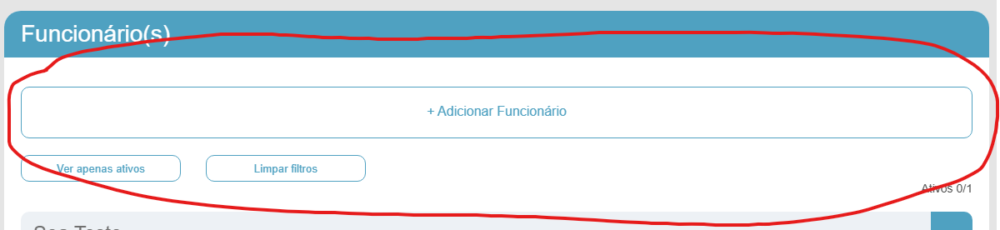
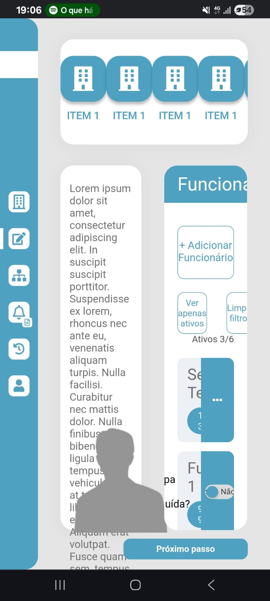
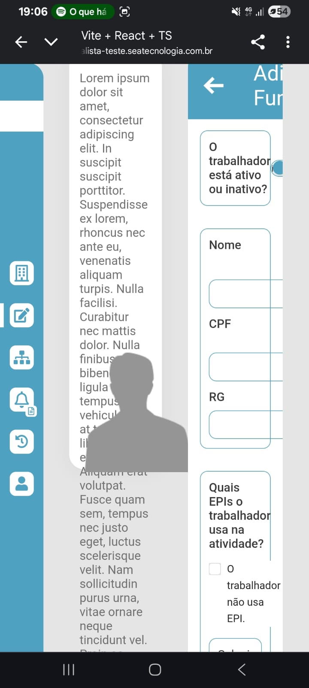

# ⚙️ Testes de funcionalidades 

A página fornecida para o teste se trata de um site para gerenciamento e cadastro de novos funcionarios.

## 👷 Testando cadastrar novo funcionario:

De incio comecei testando o botão "Adicionar novo funcionario" que tem como objetivo cadastrar novos funcionarios com seus dados pessoais e de acordo com o EPI que ele utiliza em sua função. 
Quando clico no botão, ocorre tudo certo, o botão funciona de acordo como o do prototipo.

<p align="center">
  
</p>

Para chegar nesse botão de forma automatizada utilizei o seguinte código no Cypress:

```bash
 cy.get('button.c-kUQtTK').click();
```
*Utilizei o ChromeDevTools para achar o nome da propriedade do botão "Adicionar Funcionário" que é c-kUQtTK, então fiz a referência no código para que assim quando rodasse ele fizesse a procura no site desse botão e assim que encontrasse fizesse a ação de clicar.*

---

## 📝 Campo de mome e CPF

Após isso a página nos redireciona para outra tela onde devemos preencher os campos necessários para cadastrar um novo funcionário. Para testar os campos foram utilizado tanto o teste manual, quanto o automatizado com o uso de Cypress.

Foi testado o campo do CPF e ao digitar mais do que 11 dígitos ele fornece um erro, então o campo do CPF está funcionando bem em questão de número máximo de dígitos. Também testei a limitação de dígitos mínimos e ao digitar menos que 11 é mostrado uma mensagem para que o usuário se atente ao número de caracteres mínimos.

Porém como pode ver na imagem abaixo, eu realizei o teste digitando caracteres alfabeticos, algo que pode ser considerada uma falha para esse campo. Elaborarei isso mais para frente.

<p align="center">
  
</p>

A imagem abaixo mostra um erro no Cypress, pois no código coloquei para que ele digitasse um número maior do que o permitido para o campo do CPF. Fiz isso para confirmar que o limite de caracteres no CPF está funcionando corretamente.

<p align="center">
  
</p>

Código usado para realizar essa automação:

```bash
 cy.get('input[name="cpf"]').should('have.value', '12345678901');
```

Porém no cadastro de CPF é possivel notar uma falha. Sabemos que CPF são somente números e no campo do CPF é possivel digitar letras, algo que foge do padrão do CPF. Esse erro possivelmente está associado com o JS da página que provavelmente não está habilitado para que o campo do CPF seja permitido apenas números.
Esse mesmo erro também acontece com o campo do RG.

Abaixo segue a imagem do teste automatizado utilizando caracteres alfabéticos.

<p align="center">
  
</p>

Para realizar esse teste bastou eu alterar o código anterior para digitar o campo de CPF com número, porém colocando para que digitasse "cpfnumeros".

```bash
  cy.get('input[name="cpf"]').type('12345678901')
```

Falha como essa compromete muito o funcionamento do site e a função de cadastrar novos funcionarios, pois abre brecha para que usuário sejam cadastrados com CPF errados, sendo assim uma falha critica para o site.

---

## 📝 Campo de RG

Agora no campo do RG é possível encontrar um erro de limite de caracteres. Normalmente um RG tem entre 7 e 9 dígitos, porém no campo do RG é permitido digitar um número infinito de dígitos. Dessa forma, é bem provavel que o código JS também não está configurado especificando o limite de caracteres para esse campo. Se esse for o caso, é bem provavel que o comando **"maxlength="** resolva o problema do limite de caracteres.

Código de automação utilizado:
```bash
 cy.get('input[name="rg"]').type('123456789121212131313142312');
```

Essa também é uma falha critica para o site e seu objetivo, pois isso tornar o cadastro de RG do funcionario vuneravel e muito sucetivo a erros.

<p align="center">
  
</p>

---

## 📝 Campo de data de nascimento

No campo de data de nascimento é possível notar que há uma falha que faz com que o usuário possa escolher a data de nascimento no futuro da data atual. Por exemplo, é possível colocar a data de nascimento no dia 27/10/2027 sendo que estamos em 2025, algo que não faz sentido. Para resolver esse problema os Devs deve limitar a data para até um certo ano que seja o limite mínimo de idade para os cargos.

Mais uma falha critica no sistema de cadastro do site, que faz com qe torce o funcionamento vuneravel.


<p align="center">
  
</p>

<p align="center">
  
</p>

Algo que difere do protótipo é que no campo de data de nascimento é possível notar que existe somente o campo onde será inserido a data, não é possível selecionar o calendário. Talvez nesse quesito o site de testes seja até mais completo, porém não funciona, visto que existem falhas.
Imagem de referência do protótipo:

<p align="center">
  
</p>

---

O campo de alteração de sexo parece funcionar bem, não indentifiquei nenhum problema.

<p align="center">
  
</p>

---

No campo onde selecionamos as EPIs em que o trabalhador usará nas atividades, é possível notar que há um erro quando é informado o CA, o campo não possui limite de caracteres, semelhante a falha encontrada nos campos de RG e CPF, anteriormente.

<p align="center">
  
</p>

Também notei que não é possivel adionar a EPI 🔨. O botão de "Adicionar EPI" na versão de testes não funciona e também possui o Layout diferente do mesmo botão no protótipo.

Abaixo está uma comparação entre os dois:

## 📝Protótipo: ##

<p align="center">
  
</p>

## 🧪Teste: ##

<p align="center">
  
</p>

---

Na página inicial na parte onde é listada os funcionários, não consigo excluir os que criei, simplesmente o botão onde aparece a funcionalidade de excluir ou modificar não aparece.

<p align="center">
  
</p>

Era para aparecer algo assim, como no protótipo:

<p align="center">
  
</p>

Ao inspesionar o site com o ChromeDevTools e verificar a aba de "Conexão" é possivel notar que há uma fonte que não foi carregada, é fornecido o erro "400 Bad Request".

<p align="center">
  
</p>

Esse erro da falha de carregamento da fonte acontece devido a um erro de sintaxe na url da fonte. faltou o "&" antes do "display=swap"

Ao copiar e corrigir o link da fonte pesquisar é possível notar que o link existe e a fonte está no ar, como a imagem abaixo mostra:

<p align="center">
  
</p>

Esse é um erro que pode ser facilmente corrigido no código onde o link da fonte está vinculada.

Há um erro em relação ao filtro de funcionários ativos. Quando filtrado apenas por funcionários ativos é possível notar que mesmo o funcionário "Sea Teste" que está como "Ativid 2" acaba sumindo quando ativado o filtro, algo que não era para acontecer.

Antes de ativar o filtro:

<p align="center">
  
</p>

Após ativar o filtro para apenas funcionários ativos:

<p align="center">
  
</p>

É possível notar que o funcionário "Sea Teste" sumiu.

O campo de adicionar documento parece estar funcionando bem, consegui anexar um documento sem problemas.

<p align="center">
  
</p>

O menu do quanto esquerdo não está funcionando, quando seleciono alguma opção que não seja a que já estamos, nada acontece.

<p align="center">
  
</p>

E por fim, o ultimo erro que percebi foi que ao marca como etapa concluída e clicar em próximo, nada acontece. No protótipo quando fazemos esse procedimento, é nos enviado para outra etapa.

<p align="center">
  
</p>

---

## Teste em diferentes navegadores

Realizei abrir o site no celular e a visualização dele mobile é completamente confusa e fora do padrão do protótipo. A visualização mobile chega a ser impossivel de navegar pelo site, se tornando inoperante.

<p align="center">
  
  
</p>

Essa é uma falha critica para o bom funcionamento do site, pois assim impossibilidade o usuário de utilizar a plataforma já que não tem usabilidade nenhuma.

---

Também foi realizado o teste em diversos navegadores como o Chrome, Firefox, Edege e Opera.
Nos três navegadores a usabilidade é a mesma e os mesmos problemas persistem.

---

Os testes realizados, tantos os automatizados e os manuais de forma encontraram os erros descritos acima. Ao meu ver o site possui muitas desconformidades em relação ao protótipo, o que inviabilizaria o uso em um cenário real.